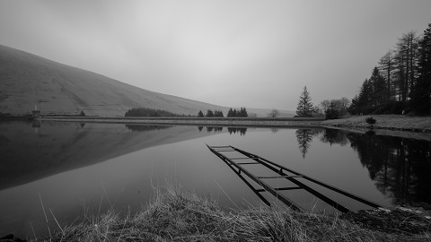
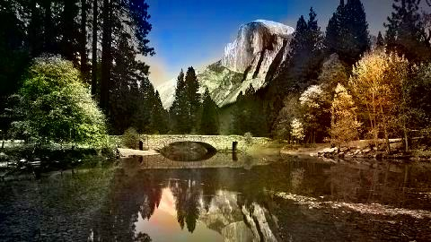
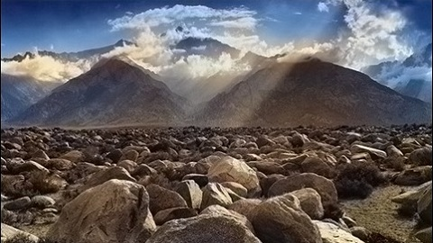

# Colorizing Grayscale Images by Modifying Pretrained Inception Network
Modified an inception model and trained it on 10K images to colorize grayscale pictures. As for color space, CIELAB is used to separate lightness as input and a* and b* as outputs of the convolutional neural network. (Color masks below are a* and b* together with L=50 to illustrate raw output)

## Best Results:
Input Grayscale Image | Colorized Output Image | Tuned Saturation | Raw Output Color Mask
------------ | -------------  | ------------- | -------------
 |  |  | 
 |  |  | 
 |  |  | 
 |  |  |  

## Comparison with [Zhang Colorization](https://arxiv.org/abs/1603.08511)
Please note that as mentioned in [Zhang's paper](https://arxiv.org/abs/1603.08511), their model was trained on over a million color images; however, I only had 10,000 pictures.
Input Grayscale Image | My Result | Tuned Saturation | Zhang et al.
------------ | -------------  | ------------- | -------------
 |  |  | 
 |  |  | 

## Inception Model Modification
The best results were observed when I used the Inception network's layers with weights of Imagenet, and I replaced the last 19 layers by a small CNN, including Conv2d, BatchNormalization, and Conv2DTranspose layers to recreate a picture with the same size as input. For 100 epochs, I fixed the weights, but after showing no more improvement, I made all the parameters trainable. The results above are from about 100 epochs after that change.
