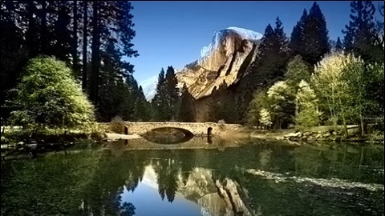
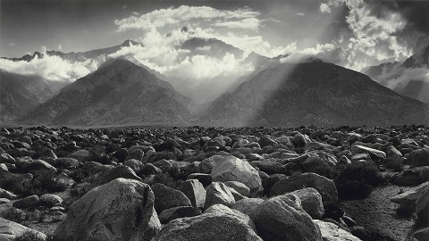

# image_colorizer_using_CNN

## Best Results:
Input Grayscale Image | Colorized Output Image | Tuned Saturation | Raw Output Color Mask
------------ | -------------  | ------------- | -------------
 |  |  | 
 |  |  | 
 |  |  | 
 |  |  |  

## Comparison with [Zhang](https://arxiv.org/abs/1603.08511)
Please note that as mentiond in [Zhang's paper](https://arxiv.org/abs/1603.08511), their model was trained on over a million color images, however, I only had 10,000 pictures.
Input Grayscale Image | My Result | Increased Saturation | Zhang et al.
------------ | -------------  | ------------- | -------------
 |  |  | 
 |  |  | 
